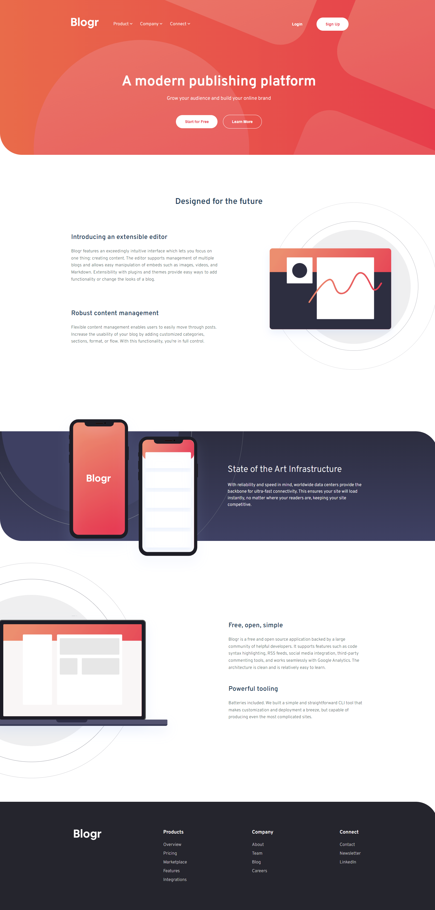

# Bloger Landing Page Project

This is a solution to the [Blogr landing page challenge on Frontend Mentor](https://www.frontendmentor.io/challenges/blogr-landing-page-EX2RLAApP). Frontend Mentor challenges help you improve your coding skills by building realistic projects. 

## Content:

- [Overview](#overview)
  - [The challenge](#the-challenge)
  - [Screenshot](#screenshot)
  - [Links](#links)
- [My process](#my-process)
  - [Tech Stack](#tech-stack)
  - [Built with](#built-with)
  - [What I learned](#what-i-learned)
  - [Continued development](#continued-development)
- [Author](#author)

## Overview

### The challenge

Users should be able to:

- Adaptive view depending on device's screen size
- Experience hovering interactive elements on the page

### Screenshots of results

Desktop(1440px):

Mobile(325px):

### Links

- Solution URL: [Solution URL](https://www.frontendmentor.io/solutions/responsive-landing-page-with-css-grid-and-vanilla-js-B173HLQr5)
- Live Site URL: [Live site URL](https://blogr-landing-page-evertrix.netlify.app/)

## My process

### Tech Stack

HTML, CSS(SCSS), JS

### Built with

- Semantic HTML5 markup
- SCSS(variables, nesting)
- CSS Grid
- Desktop-first approach
- Vanilla JavaScript for navigation section

### What I learned

Multiple different approaches had come through my mind to solve the constuction design of the landing page. Thought, I managed to create everything with CSS Grid. The structure of the navigatation happend to be the hardest part to sync with everything else both for desktop and mobile. 
By building this project, I managed to test my skills in building and understanding more about grid layouts.

### Continued development

The JavaScript code logic needs a bit more enhancing to which I will be make more commits to this repository in the next couple of days. Also, I will be heading to create some transitions while toggling the navigation.

## Author

- Website - [Github/evertrix](https://github.com/Evgeni-Georgiev)
- Frontend Mentor - [@Evertrix](https://www.frontendmentor.io/profile/Evertrix)
- LinkedIn - 

Thank you!